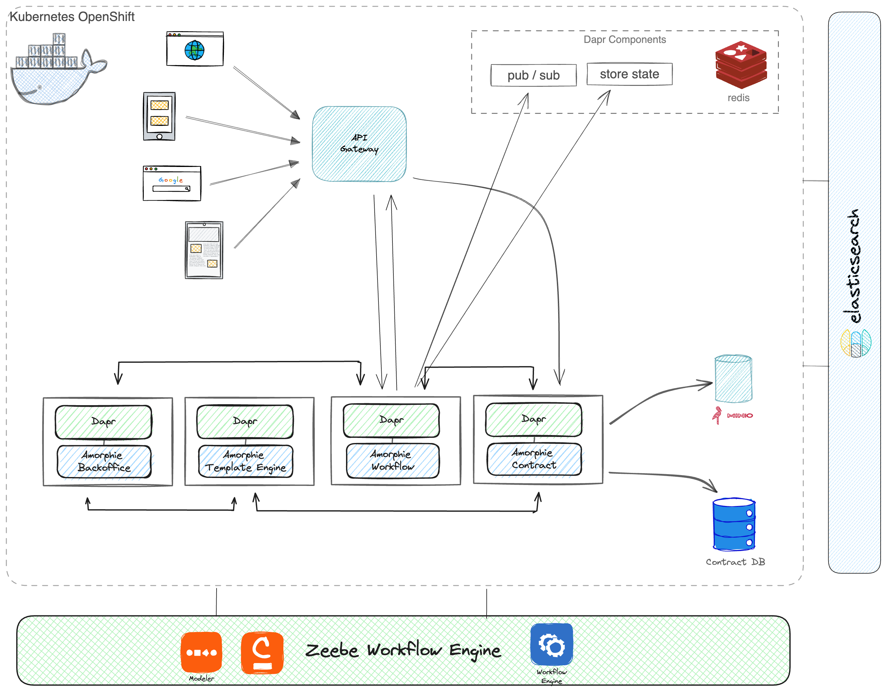

# Amorphie Contract

The main purpose of this project is to validate and show documents to users. 

Lorem ipsum dolor sit amet, consectetur adipiscing elit. Nam facilisis, sem at finibus ultricies, lorem urna mattis sapien, vel viverra mauris lorem a risus. Duis id velit sem. Curabitur neque urna, cursus eget erat nec, dictum cursus risus. Etiam nec blandit libero. Vestibulum tincidunt ornare laoreet. Mauris vehicula ante sed elementum rhoncus. Ut placerat consectetur dui.

Nullam mollis ex mollis, scelerisque ex id, vehicula lorem. Cras vel porttitor turpis. Cras fringilla erat vel mauris volutpat mattis et convallis quam. Vestibulum ante ipsum primis in faucibus orci luctus et ultrices posuere cubilia curae; Suspendisse ultrices feugiat luctus. Sed ut risus lectus. Duis in mattis magna. Duis in iaculis nisi, vestibulum interdum lorem. Aliquam viverra ornare turpis vitae consequat. Nulla pellentesque libero et sodales mollis. Nullam accumsan, nibh convallis posuere faucibus, ex nunc efficitur magna, in scelerisque enim urna vel augue. Proin venenatis vulputate ornare.

## Diagram

## Run the app

You will need the following tools:

* [Visual Studio Code](https://code.visualstudio.com/download/)
* [.Net 7.0 or later](https://dotnet.microsoft.com/en-us/download/dotnet/7.0)
* [Docker Desktop](https://www.docker.com/products/docker-desktop)
* [Dapr](https://docs.dapr.io/getting-started/install-dapr-cli/)

    1. Clone repository.
    2. For VSCode
        * Open the contract project directory in VS Code
        * Install plugins: C#, C# Dev Kit, Dapr (from Microsoft)
        * You can run "amorphie-contract" or "amorphie.contract.zeebee" from the Run and Debug tab.
    4. API Service: cd amorphie.contract  
        * dotnet run .
    5. Zeebe Workflow Service: cd amorphie.contract.zeebe
        * dotnet run .

### Local Deployment

1. Clone repository.
2. Run the command `docker-compose -f docker-compose.local.yml up -d` in terminal
3. You can log in to the `9001` port minio admin panel and the `5050` port pgadmin admin panel with the test users in the `docker-compose.local` file.
4. Run the amorphie-contract project from VSCode or VisualStudio IDE. Make sure that the appsetting section is in Development.
5. Migrate the DBContext schema in the project to local db with CodeFirst. Make sure that the Contract project is a startup project.
    * `dotnet ef database update --startup-project "amorphie.contract/amorphie.contract.csproj" --context ProjectDbContext`
 6. If you want to fill some of the test data into the DB, Run the `AutoRun` folder in the default postman collection.

 ## TODO

* Set it to work locally with MinIO OIDC
* Set TemplateEngine to run locally

# REST API

The REST API to the example app is described below.

### Postman Collection

We have prepared a Postman Collection [here](https://github.com/amorphie/contract/tree/master/amorphie.contract/Postman).

## Get list of Contracts

### Request

`GET /contracts/`

    curl -i -H 'Accept: application/json' -d 'ReferenceNo=12345&status=new' http://localhost:7000/contracts

### Response

    HTTP/1.1 201 Created
    Date: Thu, 19 Feb 2024 12:36:30 GMT
    Status: 201 Created
    Connection: close
    Content-Type: application/json
    Location: /thing/1
    Content-Length: 36

    {"id":1,"name":"Foo","status":"new"}

# Additional resources

- [Contract Management - Hackmd.io](https://hackmd.io/4MhaOBJTTt-pqLtAOz_g8A?both#Contract-Management) - for more documents check our Hackmd page.

    

